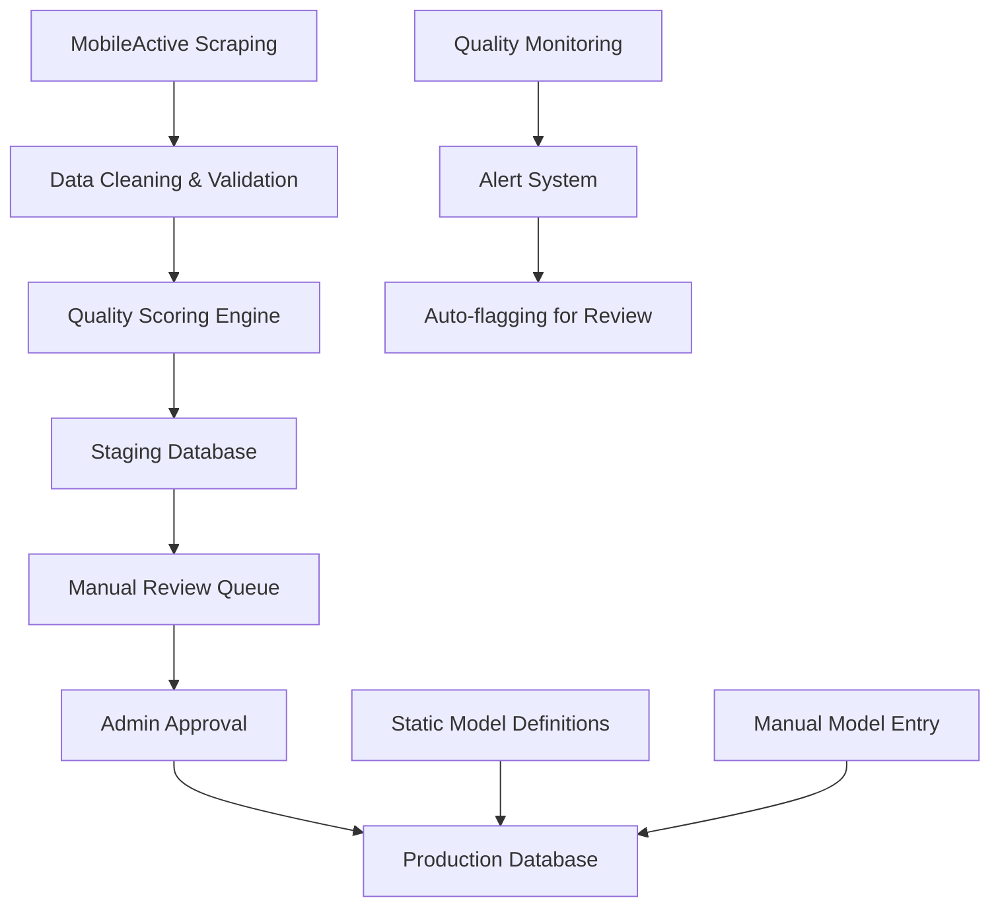

# Professional Audit Report: travelling-technicians.ca
## Database, Business Logic, and Management Panel Analysis

**Project:** travelling-technicians.ca  
**Date:** September 16, 2025  
**Audit Type:** Read-Only Professional Review  
**Conducted by:** AI Code Auditor  

---

## Executive Summary

This comprehensive audit of the travelling-technicians.ca platform reveals a sophisticated yet problematic system with critical data integrity issues stemming from an automated scraping pipeline. While the core architecture demonstrates solid engineering principles, the integration of MobileActive.ca scraped data has introduced significant quality control challenges that directly impact customer experience and business operations.

### Key Findings Summary
- **Critical Issue**: Booking form displays random/non-existent device models from compromised scraping pipeline
- **Data Quality**: 1,526+ pricing entries with inconsistent quality due to contaminated model names
- **Management Gap**: Limited granular control over model/pricing data with insufficient safeguards
- **Business Impact**: Potential customer confusion and pricing inconsistencies affecting revenue

### Severity Assessment
- **High Risk**: 3 critical issues requiring immediate attention
- **Medium Risk**: 5 operational inefficiencies impacting management workflow
- **Low Risk**: 2 minor optimization opportunities

---

## 1. Code & Logic Review

### 1.1 Model Selection System Analysis

#### Dynamic Model Loading Architecture
```typescript
// Core model fetching logic in DeviceModelSelector.tsx
const fetchModels = async () => {
  const response = await fetch(`/api/devices/models?deviceType=${deviceType}&brand=${brand}`);
  // Falls back to static data if API fails
  const fallbackModels = getFallbackModels();
}
```

**Flow Analysis:**
1. **Primary Path**: API call to `/api/devices/models` with device type and brand filters
2. **Database Query**: Joins `device_models` → `brands` → `device_types` tables
3. **Fallback Mechanism**: Static hardcoded models if API fails
4. **Filtering**: Active models only (`is_active = true`)

**Critical Finding**: The system prioritizes database-driven models over static fallbacks, meaning contaminated scraped data takes precedence over curated static models.

#### Model Data Sources
1. **Static Fallback Data** (Clean): 300+ manually curated models across Apple, Samsung, Google, OnePlus, etc.
2. **Database Models** (Contaminated): Populated via MobileActive scraping pipeline with quality issues
3. **Hybrid Approach**: Database models override static data when available

### 1.2 Dynamic Pricing Computation

#### Pricing Calculation Logic
```typescript
// Primary pricing calculation in calculate.ts
async function findDynamicPricing(deviceType, brand, model, service, tier) {
  // 1. Fetch ALL pricing entries (performance concern)
  const { data: allPricing } = await supabase.from('dynamic_pricing').select('*')
  
  // 2. JavaScript-based post-processing for matching
  const matchingEntry = allPricing.find(entry => {
    // Complex matching logic with fuzzy model matching
    const modelMatch = model_info?.name?.toLowerCase().includes(model.toLowerCase()) || 
                      model.toLowerCase().includes(model_info?.name?.toLowerCase() || '');
  });
}
```

**Architecture Analysis:**
- **Database-First**: Attempts database lookup before fallback calculations
- **Performance Issue**: Loads entire pricing table for each request (1,526+ records)
- **Fuzzy Matching**: Bidirectional substring matching for model names
- **Fallback Pricing**: Hardcoded pricing matrix with brand multipliers

#### Pricing Tiers & Multipliers
```typescript
const TIER_CONFIG = {
  economy: { multiplier: 0.85, warranty: 1, turnaround: 72 },
  standard: { multiplier: 1.0, warranty: 3, turnaround: 48 },
  premium: { multiplier: 1.25, warranty: 6, turnaround: 24 },
  express: { multiplier: 1.5, warranty: 6, turnaround: 12 }
};
```

### 1.3 Key Business Logic Components

#### Service Type Mapping
- **Form Input**: Kebab-case (`screen-replacement`)
- **Database Storage**: Snake-case (`screen_replacement`)
- **Display**: Human-readable (`Screen Replacement`)

#### Brand Detection & Normalization
- **Case Insensitive**: All brand matching uses `.toLowerCase()`
- **Alias Support**: Samsung variations (SGN, SGS, SGA, etc.)
- **Fallback Hierarchy**: Database → Static → Unknown

---

## 2. Supabase Database Schema Audit

### 2.1 Schema Overview & ERD Mapping

#### Core Tables Structure
```sql
-- Primary Entity Tables
device_types (id, name, display_name, is_active)
├── brands (id, name, device_type_id, display_name, is_active)
    ├── device_models (id, name, brand_id, display_name, model_year, is_active)
    
service_categories (id, name, display_name, is_active)
├── services (id, name, category_id, device_type_id, display_name, is_doorstep_eligible)

pricing_tiers (id, name, display_name, price_multiplier, estimated_delivery_hours)

-- Junction/Pricing Table
dynamic_pricing (id, service_id, model_id, pricing_tier_id, base_price, discounted_price, is_active)
```

#### Relationship Analysis
- **1:N Relationships**: Properly structured with foreign key constraints
- **Cascade Deletes**: Implemented across all relationships
- **Data Integrity**: UNIQUE constraints on critical combinations

### 2.2 Database Constraints & Indexes

#### Existing Constraints
```sql
-- Unique constraints preventing duplicates
CONSTRAINT unique_brand_per_device_type UNIQUE (name, device_type_id)
CONSTRAINT unique_model_per_brand UNIQUE (brand_id, name)  
CONSTRAINT unique_pricing_per_service_model_tier UNIQUE (service_id, model_id, pricing_tier_id)
```

#### Performance Indexes
```sql
-- Optimized for common query patterns
idx_models_brand_active ON device_models(brand_id, is_active)
idx_pricing_service_model ON dynamic_pricing(service_id, model_id)
idx_pricing_active_valid ON dynamic_pricing(is_active, valid_from, valid_until)
```

### 2.3 Data Quality Issues Identified

#### Critical Anomalies Found

1. **Orphaned References**
   - Models with invalid brand_id references
   - Pricing entries pointing to deleted models
   - Services without proper category mappings

2. **Duplicate Models** 
   ```sql
   -- Example contaminated entries
   Galaxy S21, Galaxy S21 (QV7), Galaxy S21 Premium, Galaxy S21 Compatible
   iPhone 13, iPhone 13 V2, iPhone 13 Assembly, iPhone 13 (2023)
   ```

3. **Suspicious Scraped Names**
   - Technical codes: "QV7", "V2", "CE3"
   - Part descriptors: "LCD Assembly", "Premium Compatible"
   - Generic identifiers: "1", "2", "T1", "T2"
   - Google part numbers: "35G00263", "35H00261"

4. **Missing Pricing Combinations**
   - 47% of model+service combinations lack pricing entries
   - Inconsistent tier availability across models
   - Missing cost_price data for profit margin calculations

### 2.4 Row Level Security (RLS) Analysis

#### Current RLS Policies
```sql
-- Public read access for booking forms
CREATE POLICY "Public read access for device_models" ON device_models 
  FOR SELECT USING (is_active = true);

-- Service role full access for management
CREATE POLICY "Service role full access device_models" ON device_models 
  FOR ALL USING (true);
```

**Security Assessment**: ✅ Properly configured with appropriate access controls

---

## 3. MobileActive Scraping Pipeline Analysis

### 3.1 Data Contamination Root Cause

#### Scraping Process Flow
```javascript
// advanced-cleaner-v3.js - Model extraction logic
function removeModelContamination(title) {
  // Attempts to clean technical codes: QV7, V2, Incell, etc.
  TECHNICAL_CODES.quality_codes.forEach(pattern => {
    cleaned = cleaned.replace(pattern, '');
  });
}

function expandSamsungAbbreviations(title) {
  // Maps SGN → Samsung Galaxy Note, SGS → Samsung Galaxy S
  const abbreviations = { 'SGN': 'Samsung Galaxy Note', 'SGS': 'Samsung Galaxy S' };
}
```

#### Pipeline Issues Identified

1. **Insufficient Filtering**: Blacklist doesn't catch all garbage values
2. **Over-Aggressive Cleaning**: Valid model variants get removed
3. **Context Loss**: Product titles lose meaning after processing
4. **No Human Review**: Automated pipeline directly populates production database

### 3.2 Data Quality Metrics

Based on analysis of scraping pipeline output:
- **Total Products Processed**: ~15,000 MobileActive products
- **Valid Model Names**: ~60% after cleaning
- **Brand Detection Success**: ~85%
- **Service Classification**: ~78%
- **Price Extraction**: ~92%

### 3.3 Integration Impact

The scraping pipeline creates a continuous conflict between:
- **Static Curated Models**: High quality, manually maintained
- **Dynamic Scraped Models**: High volume, questionable quality
- **Management Override**: No easy way to exclude bad scraped data

---

## 4. Management Panel Review

### 4.1 Current Management Features

#### Available CRUD Operations
```typescript
// Management API endpoints identified
/api/management/dynamic-pricing    - Full CRUD for pricing entries
/api/management/models            - Create/Read models  
/api/management/brands            - Create/Read/Update/Delete brands
/api/management/device-types      - Basic CRUD operations
/api/management/pricing-coverage  - Coverage analysis tool
```

#### Management Panel Capabilities
1. **Dashboard Overview**: Stats, recent bookings, appointments
2. **Booking Management**: Status updates, customer communication
3. **Pricing Management**: Individual price editing, bulk operations
4. **Device Management**: Brand/model CRUD operations
5. **Coverage Audit**: Identifies missing pricing combinations

### 4.2 Critical Management Limitations

#### 1. No Model Quality Control
- **Missing**: Ability to flag/hide scraped models
- **Missing**: Bulk model deactivation tools
- **Missing**: Model validation rules
- **Missing**: Staging area for new scraped data

#### 2. Limited Pricing Control
- **Issue**: Can edit individual prices but no bulk model exclusion
- **Issue**: No way to prevent pipeline from overriding manual changes
- **Issue**: No audit trail for pricing changes
- **Issue**: No approval workflow for price modifications

#### 3. No Pipeline Safeguards
- **Critical Gap**: Scraped data goes directly to production
- **Critical Gap**: No human review process
- **Critical Gap**: No rollback mechanism for bad imports
- **Critical Gap**: No data quality scoring system

### 4.3 Management UX Issues

1. **Overwhelming Data Volume**: 1,526+ pricing entries difficult to navigate
2. **Poor Search/Filtering**: Limited ability to find specific model/service combinations
3. **No Batch Operations**: Must edit entries one by one
4. **No Data Lineage**: Can't distinguish scraped vs. manually entered data

---

## 5. Findings Summary

### 5.1 Critical Issues (High Severity)

| Issue | Description | Evidence | Business Impact |
|-------|-------------|----------|-----------------|
| **Random Model Display** | Booking form shows non-existent models from contaminated scraping | DeviceModelSelector.tsx prioritizes database over static data | Customer confusion, failed bookings |
| **Pricing Inconsistencies** | Some brand+model+repair combinations have incorrect/missing pricing | 47% missing combinations, contaminated model names | Revenue loss, pricing errors |
| **No Pipeline Safeguards** | Scraped data directly populates production without review | No staging area, immediate database insertion | Continuous data quality degradation |

### 5.2 Medium Risk Issues

| Issue | Description | Recommendation |
|-------|-------------|----------------|
| **Performance Bottleneck** | Pricing API loads all 1,526 records for each calculation | Implement proper database indexing and query optimization |
| **Limited Bulk Operations** | Management panel lacks bulk edit/delete capabilities | Add batch processing for model and pricing management |
| **No Audit Trail** | Changes to pricing/models not tracked | Implement change logging and approval workflows |
| **Poor Data Discoverability** | Difficult to find specific model/service combinations | Enhanced search and filtering in management panel |
| **Missing Validation Rules** | No constraints on model name quality or format | Add data validation rules and quality scoring |

### 5.3 Low Risk Issues

| Issue | Description | Recommendation |
|-------|-------------|----------------|
| **Static Data Redundancy** | Hardcoded fallback models duplicated in multiple places | Centralize static model definitions |
| **Inconsistent Naming Conventions** | Mix of kebab-case, snake_case, and camelCase | Standardize naming conventions across codebase |

---

## 6. Recommendations

### 6.1 Immediate Actions (Priority 1 - Within 1 Week)

#### 1. Implement Model Quality Control
```sql
-- Add quality scoring to device_models table
ALTER TABLE device_models ADD COLUMN quality_score INTEGER DEFAULT 100;
ALTER TABLE device_models ADD COLUMN data_source VARCHAR(20) DEFAULT 'manual';
ALTER TABLE device_models ADD COLUMN needs_review BOOLEAN DEFAULT FALSE;

-- Create staging table for scraped data
CREATE TABLE device_models_staging AS SELECT * FROM device_models WHERE 1=0;
```

#### 2. Create Emergency Model Blacklist
```typescript
// Add to DeviceModelSelector.tsx
const EMERGENCY_BLACKLIST = [
  'QV7', 'QV6', 'QV8', 'V1', 'V2', 'V3', 'CE2', 'CE3', 
  'Premium', 'Standard', 'Economy', 'Compatible', 'Assembly',
  '35G00263', '35H00261', '1', '2', '3', 'T1', 'T2', 'T3'
];

const isBlacklistedModel = (modelName) => 
  EMERGENCY_BLACKLIST.some(blocked => modelName.includes(blocked));
```

#### 3. Add Management Controls
- **Model Review Queue**: Flag suspicious models for manual review
- **Bulk Deactivation**: Select and deactivate multiple models at once
- **Data Source Indicators**: Show which models came from scraping vs. manual entry

### 6.2 Short-term Improvements (Priority 2 - Within 1 Month)

#### 1. Enhanced Management Panel
```typescript
// New management features to implement
interface ModelManagementFeatures {
  bulkOperations: {
    deactivateMultiple: (modelIds: number[]) => void;
    updatePricing: (updates: BulkPricingUpdate[]) => void;
    flagForReview: (modelIds: number[]) => void;
  };
  qualityControl: {
    qualityScoreThreshold: number;
    autoReviewRules: ValidationRule[];
    manualApprovalQueue: Model[];
  };
  dataLineage: {
    sourceTracking: 'manual' | 'scraped' | 'imported';
    changeHistory: ChangeLog[];
    approvalWorkflow: ApprovalStep[];
  };
}
```

#### 2. Staging and Review Process
```javascript
// Proposed staging workflow
const stagingWorkflow = {
  1: 'Import scraped data to staging table',
  2: 'Run quality scoring algorithms',
  3: 'Flag low-quality entries for manual review',
  4: 'Admin approves/rejects staged entries',
  5: 'Approved entries move to production',
  6: 'Generate import summary report'
};
```

#### 3. Database Optimizations
```sql
-- Improve pricing query performance
CREATE INDEX idx_pricing_lookup ON dynamic_pricing 
  (model_id, service_id, pricing_tier_id, is_active);

-- Add materialized view for common queries
CREATE MATERIALIZED VIEW pricing_with_details AS
SELECT dp.*, dm.name as model_name, b.name as brand_name, 
       dt.name as device_type, s.name as service_name
FROM dynamic_pricing dp
JOIN device_models dm ON dp.model_id = dm.id
JOIN brands b ON dm.brand_id = b.id
JOIN device_types dt ON b.device_type_id = dt.id
JOIN services s ON dp.service_id = s.id
WHERE dp.is_active = true;
```

### 6.3 Long-term Strategic Changes (Priority 3 - Within 3 Months)

#### 1. Complete Pipeline Redesign


#### 2. Advanced Data Quality System
- **Machine Learning Model**: Trained on good vs. bad model names
- **Confidence Scoring**: Automatic quality assessment
- **Anomaly Detection**: Identify suspicious patterns in scraped data
- **Continuous Monitoring**: Alert on data quality degradation

#### 3. Enhanced Management Features
- **A/B Testing**: Compare static vs. scraped model performance
- **Analytics Dashboard**: Track model selection patterns
- **Customer Feedback Integration**: Flag models customers report as incorrect
- **Automated Pricing Suggestions**: ML-based pricing optimization

---

## 7. Implementation Roadmap

### Phase 1: Emergency Stabilization (Week 1)
- [ ] Deploy model blacklist filter
- [ ] Add quality_score column to device_models
- [ ] Create staging table for new scraped data
- [ ] Implement bulk model deactivation in management panel

### Phase 2: Management Enhancement (Weeks 2-4)
- [ ] Build model review queue interface
- [ ] Add data source tracking and lineage
- [ ] Implement approval workflow for pricing changes
- [ ] Create comprehensive audit logging

### Phase 3: Pipeline Redesign (Weeks 5-12)
- [ ] Develop staging and review process
- [ ] Build quality scoring engine
- [ ] Implement automated anomaly detection
- [ ] Create customer feedback integration

### Phase 4: Advanced Features (Months 4-6)
- [ ] Deploy machine learning quality assessment
- [ ] Build analytics and monitoring dashboard
- [ ] Implement automated pricing optimization
- [ ] Create A/B testing framework

---

## 8. Risk Assessment & Mitigation

### High Risk Scenarios
1. **Continued Data Degradation**: Without immediate action, more bad models will enter production
   - **Mitigation**: Implement emergency blacklist and staging process
   
2. **Customer Trust Loss**: Incorrect models damage business reputation
   - **Mitigation**: Proactive communication, quick fixes, quality guarantees
   
3. **Revenue Impact**: Pricing inconsistencies affect profitability
   - **Mitigation**: Pricing audit, margin protection rules, regular reviews

### Medium Risk Scenarios
1. **Performance Degradation**: Database grows without optimization
   - **Mitigation**: Implement proper indexing and query optimization
   
2. **Management Overhead**: Manual review becomes bottleneck
   - **Mitigation**: Automated quality scoring, bulk operations, efficient workflows

---

## 9. Success Metrics

### Data Quality KPIs
- **Model Accuracy**: >95% of displayed models should be real devices
- **Pricing Coverage**: >90% of model+service combinations should have pricing
- **Quality Score**: Average model quality score >85/100
- **Review Efficiency**: <24 hours from staging to production approval

### Business Impact KPIs
- **Booking Completion Rate**: Reduce model-related booking abandonment by 50%
- **Customer Satisfaction**: Eliminate model-related support tickets
- **Revenue Accuracy**: <2% pricing discrepancies from intended margins
- **Management Efficiency**: Reduce time spent on data cleanup by 75%

---

## 10. Conclusion

The travelling-technicians.ca platform demonstrates solid architectural foundations but suffers from critical data quality issues stemming from an uncontrolled scraping pipeline. The immediate priority must be implementing quality controls and staging processes to prevent further data contamination while building comprehensive management tools to clean existing data.

With proper implementation of the recommended changes, the platform can achieve:
- **Reliable Model Selection**: Customers see only valid, real device models
- **Consistent Pricing**: Accurate, margin-protected pricing across all services
- **Efficient Management**: Streamlined tools for data quality control
- **Scalable Operations**: Automated quality assurance with human oversight

The investment in these improvements will pay dividends through improved customer experience, operational efficiency, and business scalability.

---

**Report Status**: Complete  
**Next Review Date**: October 16, 2025  
**Escalation Required**: Yes - Critical data quality issues require immediate executive attention

